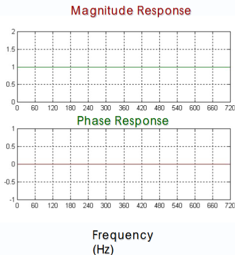
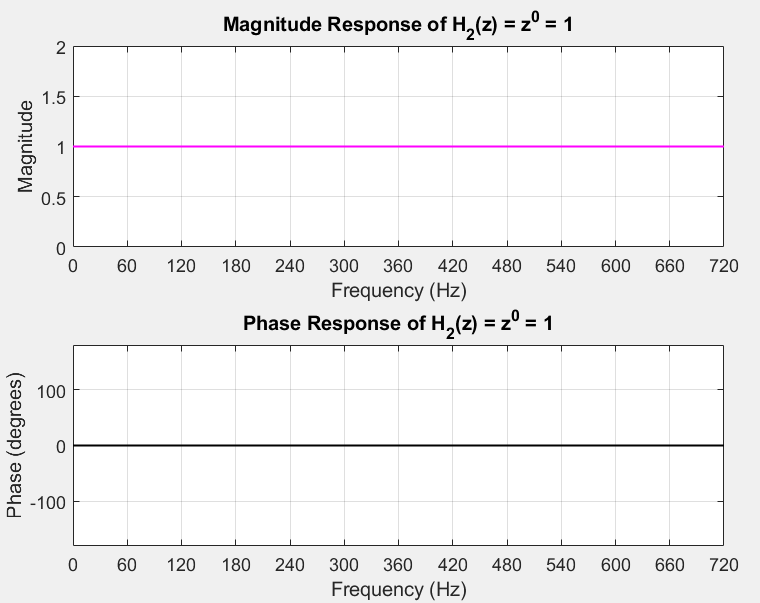
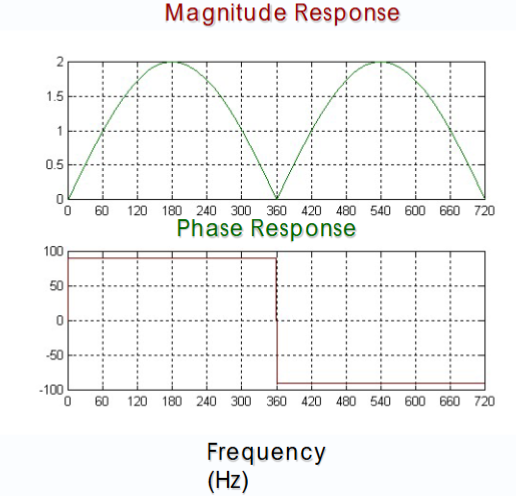
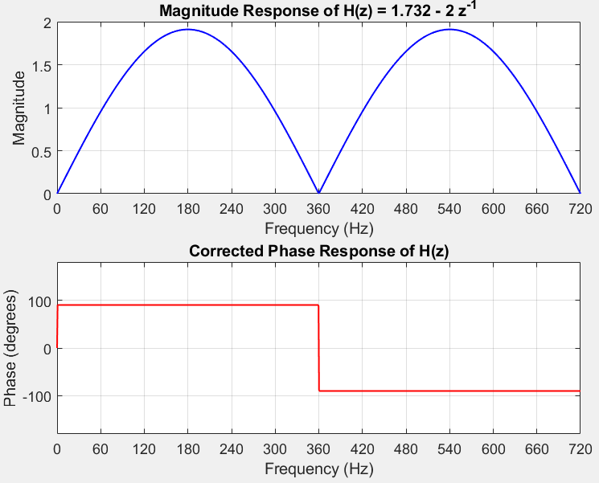

%%%%%%%%%%%%%%%%%%%%%%%%%%%%%%%%%%%%%%%%%%%%%%%%%%%%%%%%%

%% Initializing Variables with Parameters

fs = 720; % Sampling frequency

T = 1 / fs; % Sampling period

f = linspace(0, fs, 1000); % Frequency range for plotting 创建从0-720的1000个频率点，linespace表示线性距离的

omega = 2 * pi * f; % Discrete angular frequency (radians/sample)

%%%%%%%%%%%%%%%%%%%%%%%%%%%%%%%%%%%%%%%%%%%%%%%%%%%%%%%%%

% --- H(z) REAL PART Vp COS(Theta) ---

z = exp(1j * omega * T); % z = e(jωT) 是 Z 域单位圆上的点, 1j 是复数单位 √−1 只需绘制filter plot时需要，绘制input signal时不需要z变换

H1 = 0.955 * z.^1 - 0.955 * z.^(-1);% notebook 详细解释

mag = abs(H1);

phi = atan2(imag(H1), real(H1)) * 180 / pi; % 相位角，见Matlab笔记第三点

%%%%%%%%%%%%%%%%%%%%%%%%%%%%%%%%%%%%%%%%%%%%%%%%%%%%%%%%%

% Plot magnitude and phase of H

figure; % 打开一个新的图窗，要生成一张图的时候用

subplot(2,1,1); % 就是要将画布分成几块的意思，第一个参数表示将画布分为几行，第二个是几列，第三个是该图位于哪个位置

plot(f, mag, 'b', 'LineWidth', 1); % 第一个参数表示横坐标值，第二个表示对应每个f点的纵坐标值，第三个表示线的颜色，第四个表示线宽，第五个表示线宽值

xlabel('Frequency (Hz)'); % built-in method，还可以在后面加字体和颜色，比如 xlabel('Frequency (Hz)', 'FontSize', 12, 'Color', [0 0 1]);

ylabel('Magnitude');

title('Magnitude Response of H(z) = 1.732 - 2 z^{-1}');

grid on;

xticks(0:60:720); % 刻度从0开始到720，每次增加60

xlim([0 720]); % 曲线的取值范围

subplot(2,1,2);

plot(f, phi, 'r', 'LineWidth', 1);

xlabel('Frequency (Hz)');

ylabel('Phase (degrees)');

title('Corrected Phase Response of H(z)');

grid on;

xticks(0:60:720);

xlim([0 720]);

ylim([-180 180]);

%%%%%%%%%%%%%%%%%%%%%%%%%%%%%%%%%%%%%%%%%%%%%%%%%%%%%%%%%

% --- H2(z) IMAGINARY PART Vp Sin(Theta) ---

H2 = z.^0; % =v0

mag2 = abs(H2);

phi2 = atan2(imag(H2), real(H2)) * 180 / pi;

%%%%%%%%%%%%%%%%%%%%%%%%%%%%%%%%%%%%%%%%%%%%%%%%%%%%%%%%%

% Plot magnitude and phase of H2

figure;

subplot(2,1,1);

plot(f, mag2, 'm', 'LineWidth', 1);

xlabel('Frequency (Hz)');

ylabel('Magnitude');

title('Magnitude Response of H_2(z) = z^0 = 1');

grid on;

xticks(0:60:720);

xlim([0 720]);

subplot(2,1,2);

plot(f, phi2, 'k', 'LineWidth', 1);

xlabel('Frequency (Hz)');

ylabel('Phase (degrees)');

title('Phase Response of H_2(z) = z^0 = 1');

grid on;

xticks(0:60:720);

xlim([0 720]);

ylim([-180 180]);

